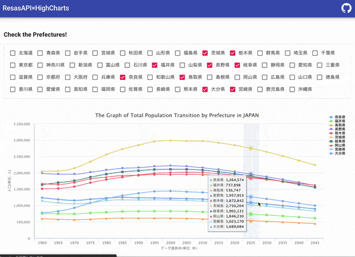

# The Graph of Total Population Transition by Prefecture



## About

demo: [Netlify: https://gracious-wright-14c3d4.netlify.app/](https://gracious-wright-14c3d4.netlify.app/)

This page uses ResasAPI with Highcharts!

- RESAS API: https://opendata.resas-portal.go.jp/
- RESAS API Documents: https://opendata.resas-portal.go.jp/docs/api/v1/index.html
- Highcharts: https://www.highcharts.com/
- Vue2-highcharts: https://www.npmjs.com/package/vue2-highcharts
- Nuxt.js: https://nuxtjs.org

## Usage

Create a .env file in the root directory and write the obtained API key as follows.

```env
REACT_APP_API_KEY=XXXXXXXXXXXXXXXXXXXXXXXXXXXXXXXXX
```

---

```bash
# install dependencies
$ yarn install

# serve with hot reload at localhost:3000
$ yarn start

# build for production and launch server
$ yarn build
```

## Library

### UI Framework

- Material-UI

### JavaScript

- React

### Hosting

- Netlify

## Contribution

- Please Create Issues, or Pull Requests.
